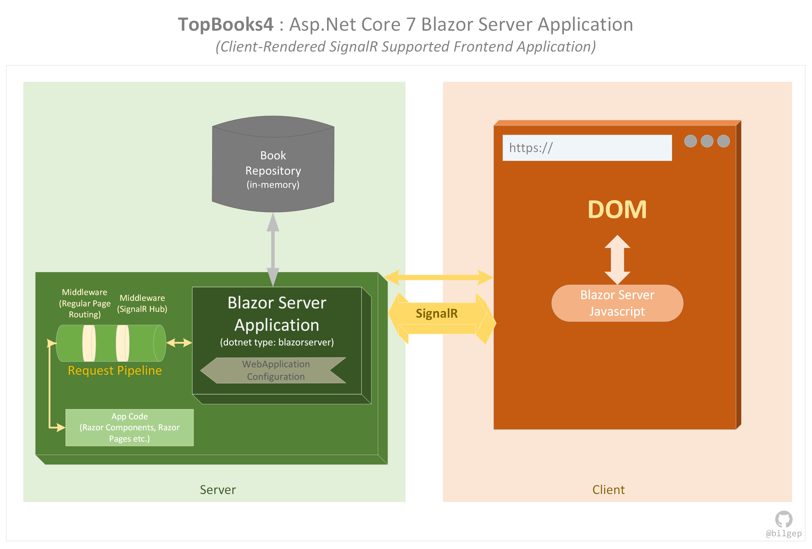
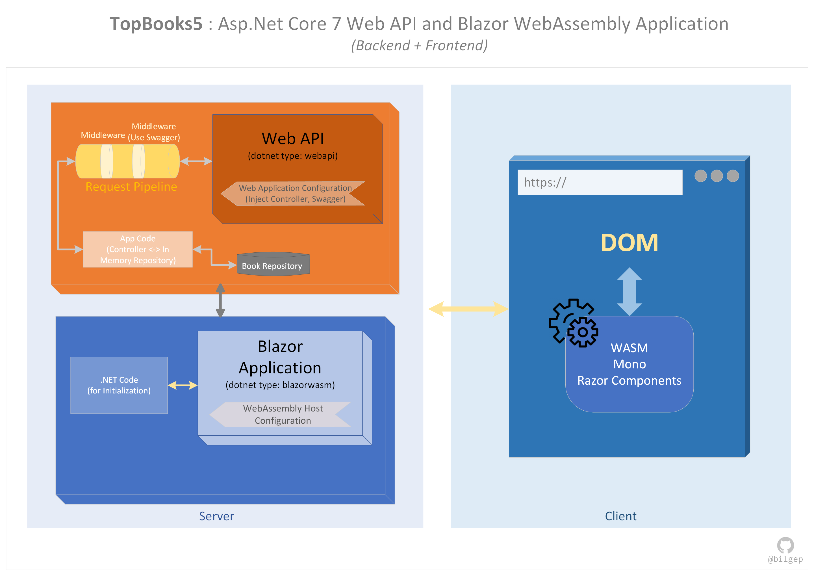
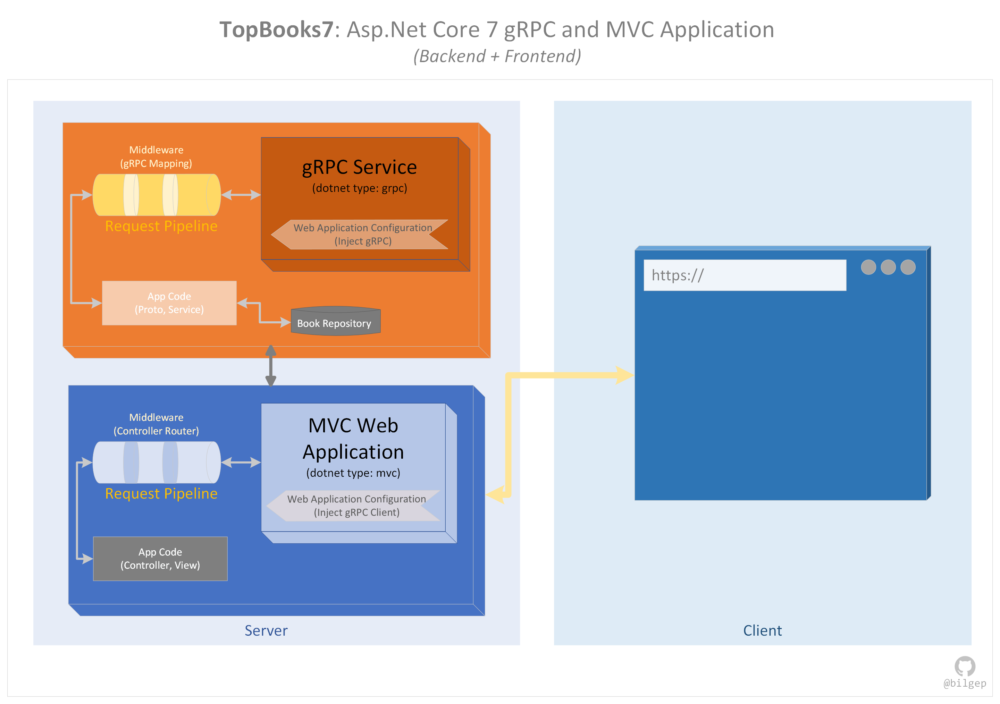
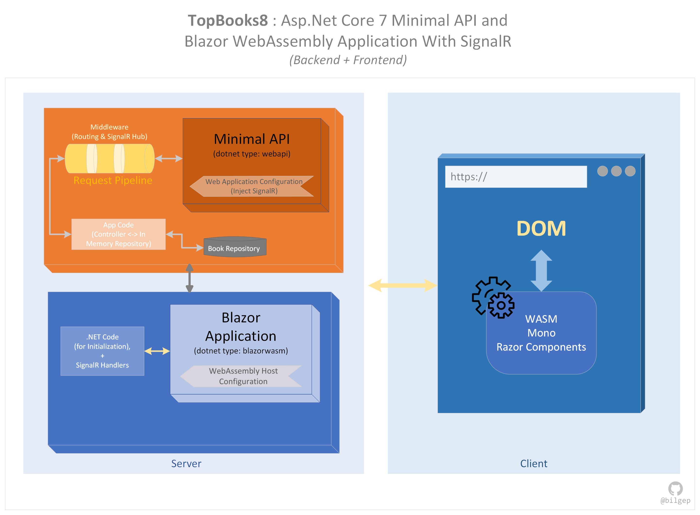

# Asp-DotNet-Core-7-Applications

This repository was created for practice purposes. It contains various solutions with different project types that come with Asp.Net Core 7 framework. These project types are; MVC Web Application, Razor Pages Web Application, Web API, Minimal Web API, Blazor WebAssembly Application, gRPC Service, and Minimal Web API with SignalR. 

All solutions contain a Home page of an imaginary bookshop that shows a book list and also contains a Create page to add new books to the existing book list.

The contained solutions and projects are explained below.

---

1. <h4><b>TopBooks1</b></h4> This is a single Asp.Net Core 7 MVC project with in-memory data used and injected. Application screenshots can be found under wwwroot folder of the project. The application diagram is shown below. 

2. <h4><b>TopBooks2</b></h4> This is a single Asp.Net Core 7 Razor Pages project with in-memory data used and injected. Application screenshots can be found under wwwroot folder of the project. The application diagram is shown below. 

3. <h4><b>TopBooks3</b></h4> This is a single Asp.Net Core 7 Blazor WebAssembly project with in-memory data used and injected. Application screenshots can be found under wwwroot folder of the project. The application diagram is shown below. 

4. <h4><b>TopBooks4</b></h4> This is a single Asp.Net Core 7 Blazor Server project with in-memory data source injected. Application screenshots can be found under wwwroot folder of the project. The application lifecycle diagram is shown below. 

5. <h4><b>TopBooks5</b></h4> This is dotNet solution that contains Asp.Net Core 7 Web API and Blazor WebAssembly projects. In-memory data source is used in Web API project. Application screenshots can be found under wwwroot folder of the project. The application lifecycle diagram is shown below. 

6. <h4><b>TopBooks6</b></h4> This is dotNet solution that contains Asp.Net Core 7 Minimal API and Blazor WebAssembly projects. In-memory data source is used in Minimal API project. Application screenshots can be found under wwwroot folder of the project. The application lifecycle diagram is shown below. 

7. <h4><b>TopBooks7</b></h4> This is dotNet solution that contains Asp.Net Core 7 MVC and gRPC Service projects. In-memory data source is used in gRPC Service project. Application screenshots can be found under wwwroot folder of the project. The application lifecycle diagram is shown below. 

8. <h4><b>TopBooks8</b></h4> This is dotNet solution that contains SignalR supported Asp.Net Core 7 Minimal API and Blazor WebAssembly projects. In-memory data source is used in Minimal API project. Application screenshots can be found under wwwroot folder of the project. The application lifecycle diagram is shown below. 

